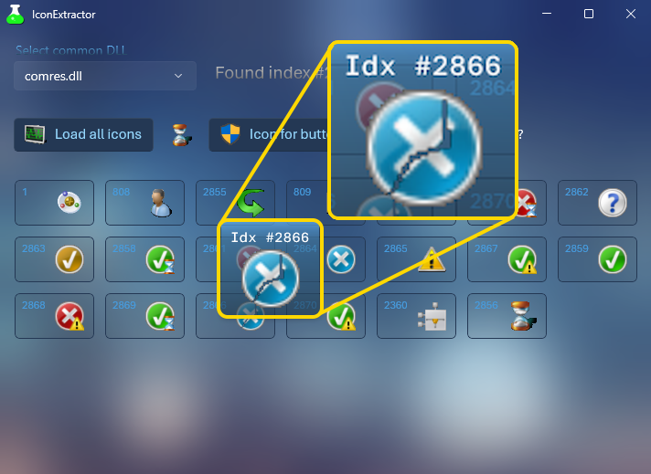

# 💻 WinUI3 - Icon Extractor

* An example of an icon extraction utility which reads the most common Windows DLL assets.
* [Nuget](https://learn.microsoft.com/en-us/nuget/what-is-nuget) packages utilized:
	- "Microsoft.WindowsAppSDK" Version="1.5.240428000" />
	- "Microsoft.Windows.SDK.BuildTools" Version="10.0.22621.3233"
	- "Vanara.Windows.Extensions" Version="4.0.1"
	- "Vanara.Windows.Shell" Version="4.0.1"

* On a side note, does anyone happen to know the story behond this icon? This isn't a rendering artifact; index #2866 in **comres.dll** seems like an internal prank to scribble/deface the asset. Was this done on purpose for some reason? Maybe the effect was to simulate being cracked in half? Out of the thousands of icons I inspected while making this project, only this one stood as an outlier.

 ## 📝 v1.0.0.0 - June 2024
* Initial release.

## 🎛️ Usage
* This application was intended to be run unpackaged, but I have added checks for running in packaged format as well.

## 🧾 License/Warranty
* Permission is hereby granted, free of charge, to any person obtaining a copy of this software and associated documentation files (the "Software"), to deal in the Software without restriction, including without limitation the rights to use, copy, modify, merge, publish and distribute copies of the Software, and to permit persons to whom the Software is furnished to do so, subject to the following conditions: The above copyright notice and this permission notice shall be included in all copies or substantial portions of the Software.
* The software is provided "as is", without warranty of any kind, express or implied, including but not limited to the warranties of merchantability, fitness for a particular purpose and noninfringement. In no event shall the author or copyright holder be liable for any claim, damages or other liability, whether in an action of contract, tort or otherwise, arising from, out of or in connection with the software or the use or other dealings in the software.
* Copyright © 2023-2024. All rights reserved.

## 📋 Proofing
* This application was compiled and tested using *VisualStudio* 2022 on *Windows 10* versions **22H2**, **21H2** and **21H1**.

